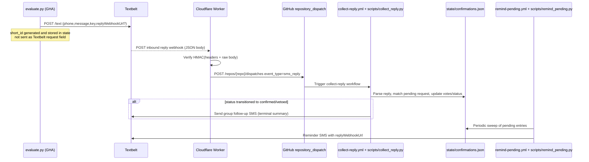

# SMS YES/NO Confirmation System Spec (farm-trader)

## 1) End-to-end round trip (current implementation)



**Sources:**  
- Worker routing + fallback to inbound handler: `/home/runner/work/farm-trader/farm-trader/cloudflare-worker/src/index.ts:149-230`  
- Outbound send + webhook attachment + confirmation record: `/home/runner/work/farm-trader/farm-trader/evaluate.py:1191-1260,1270-1340,1647-1655`  
- Dispatch from Worker to GHA: `/home/runner/work/farm-trader/farm-trader/cloudflare-worker/src/index.ts:1062-1081`  
- Workflow trigger: `/home/runner/work/farm-trader/farm-trader/.github/workflows/collect-reply.yml:6-12`  
- Reminder sweep/send: `/home/runner/work/farm-trader/farm-trader/scripts/remind_pending.py:228-289`

---

## 2) Cloudflare inbound flow (`cloudflare-worker/src/*`)

## 2.1 Endpoint path(s) and method
- `POST /` is the intended Textbelt inbound webhook endpoint.  
- Any **unknown POST path** also falls through to `textbeltReply(...)` (legacy compatibility), so practically inbound logic is default POST handler.  
- `GET /` is health check only.

**Sources:** `/home/runner/work/farm-trader/farm-trader/cloudflare-worker/src/index.ts:159-170,229,987`

## 2.2 Webhook verification (Textbelt HMAC)
- Reads headers:
  - `X-textbelt-timestamp`
  - `X-textbelt-signature`
- Computes expected signature as:
  - `expected = HMAC_SHA256_HEX(TEXTBELT_KEY, timestamp + rawBody)`
- Compares using constant-time `timingSafeEqual`.
- Rejects with `401` if headers missing or signature mismatch.

**Sources:**  
- Verification logic: `/home/runner/work/farm-trader/farm-trader/cloudflare-worker/src/index.ts:988-998`  
- HMAC helper (HMAC-SHA256 hex): `/home/runner/work/farm-trader/farm-trader/cloudflare-worker/src/index.ts:1121-1129`  
- Constant-time compare: `/home/runner/work/farm-trader/farm-trader/cloudflare-worker/src/index.ts:1137-1145`

## 2.3 Expected Textbelt reply payload shape
Worker parses JSON and requires:
- `fromNumber` (truthy)
- `text` (string)
Optional:
- `textId` (forwarded as `textbelt_id` if present)
It does **not** read a `data` field.

Type/interface in code:
```ts
interface TextBeltReply {
  textId?: string;
  fromNumber?: string;
  text?: string;
}
```

**Sources:** `/home/runner/work/farm-trader/farm-trader/cloudflare-worker/src/index.ts:107-111,1000-1009,1078`

## 2.4 Conversion to `repository_dispatch`
For non-advisor replies, Worker POSTs to:
- `https://api.github.com/repos/${env.GITHUB_REPO}/dispatches`

Payload:
- `event_type: "sms_reply"`
- `client_payload`:
  - `phone: fromNumber`
  - `text: text`
  - `received_at: new Date().toISOString()`
  - `textbelt_id: payload.textId ?? null`

**Sources:** `/home/runner/work/farm-trader/farm-trader/cloudflare-worker/src/index.ts:1062-1080`

## 2.5 Required env vars / secrets / bindings

| Name | Where bound | Used for | Required for SMS reply path? |
|---|---|---|---|
| `TEXTBELT_KEY` | Worker secret | HMAC verify inbound; also outbound SMS helper | Yes |
| `GITHUB_TOKEN` | Worker secret | `repository_dispatch` POST auth | Yes |
| `GITHUB_REPO` | `wrangler.toml [vars]` | Repo target for dispatch | Yes |
| `AUTH_PHONES` | Worker secret | Advisor branch whitelist (`?question`) | No (for basic Y/N flow) |
| `GARAGE_CODE` | Worker secret | Dashboard auth routes | No |
| `ANTHROPIC_API_KEY` | Worker secret | `/advisor` route | No |
| `ADVISOR_CONTEXT_URL` | `wrangler.toml [vars]` | `/advisor` context | No |
| `FARM_KV` | `[[kv_namespaces]]` binding | Admin orchestration routes | No |

**Sources:**  
- Env interface: `/home/runner/work/farm-trader/farm-trader/cloudflare-worker/src/index.ts:39-54`  
- Wrangler bindings/comments: `/home/runner/work/farm-trader/farm-trader/cloudflare-worker/wrangler.toml:5-25,36-44`

---

## 3) Reply parsing + matching + state logic

## 3.1 Vote parsing
Accepted vote tokens (case-insensitive):
- `Y`, `YES` => vote=`Y`
- `N`, `NO` => vote=`N`

Optional second token hint:
- `sid`: 6-char hex (`[a-f0-9]{6}`)
- commodity: `corn|soy|soybean(s)|beans` (normalizes beans/soybeans->`soy`)
- index: `1..99` integer

Regex + parser are case-insensitive and anchored at start.

**Sources:** `/home/runner/work/farm-trader/farm-trader/scripts/collect_reply.py:105-136`

## 3.2 “Most recent pending prompt for this phone” rule
Candidate list = entries where:
- key does not start with `_`
- `status == "pending"`
- `recipients[phone]` exists and `vote is None`

Sorted by `sent_at` descending (newest first).  
If exactly one candidate and no explicit hint -> use that candidate.

**Sources:** `/home/runner/work/farm-trader/farm-trader/scripts/collect_reply.py:139-152,383-386`

## 3.3 Matching behavior
- If no parseable vote -> orphan.
- If vote but no pending candidates for phone -> orphan.
- If commodity hint:
  - one match -> use it
  - many -> bounce disambiguation SMS, orphan with reason `ambiguous_commodity`
  - none -> bounce + orphan with `commodity_not_pending`
- If index hint:
  - in-range -> use Nth candidate
  - out-of-range -> bounce + orphan with `index_out_of_range`
- If still ambiguous with multiple candidates and no usable hint:
  - bounce disambiguation SMS
  - orphan with `ambiguous_no_sid` and `pending_sids`
- If explicit/derived sid not found in state -> orphan with `short_id`

**Sources:** `/home/runner/work/farm-trader/farm-trader/scripts/collect_reply.py:240-399`

## 3.4 Vote application + terminal status
On matched entry:
- Store per-recipient:
  - `vote`
  - `replied_at`
  - `raw` (raw inbound text)
- Aggregate status:
  - any `N` => `vetoed` (terminal)
  - else all votes are `Y` => `confirmed` (terminal)
  - else `pending`
- On transition into terminal, send group follow-up SMS.

**Sources:** `/home/runner/work/farm-trader/farm-trader/scripts/collect_reply.py:409-450`

## 3.5 `state/confirmations.json` schema (private)
Top-level:
- `"<short_id>"` objects (one per prompt)
- optional `"_orphans"` array

Core per-short_id fields (from evaluate flow):
- `signal_key`
- `sent_at`
- `message`
- `status` (`pending|confirmed|vetoed`)
- `live_price` (optional)
- `prior_fired_price` (optional)
- `recipients`: map `phone -> recipient state`

Recipient state fields observed:
- `vote` (`null|Y|N`)
- `replied_at` (optional)
- `raw` (optional)
- `last_reminded_at` (optional)
- `reminders_sent` (optional)
- plus optional metadata from test/broadcast tooling: `name`, `send_ok`

Other optional prompt metadata from test/broadcast tooling:
- `kind`, `required`, `optional`, `pulses`

Orphan object fields observed:
- always: `phone`, `text`, `received_at`
- optional: `vote`, `short_id`, `reason`, `pending_sids`

**Sources:**  
- Core write shape: `/home/runner/work/farm-trader/farm-trader/evaluate.py:1331-1339`  
- Reminder metadata writes: `/home/runner/work/farm-trader/farm-trader/scripts/remind_pending.py:286-289`  
- Reply updates + orphan variants: `/home/runner/work/farm-trader/farm-trader/scripts/collect_reply.py:242-246,255-260,288-292,305-309,326-330,372-379,391-397,409-413`  
- Extra broadcast metadata write: `/home/runner/work/farm-trader/farm-trader/scripts/send_farm_test_broadcast.py:231-243`  
- Real file examples: `/home/runner/work/farm-trader/farm-trader/state/confirmations.json:2-244`

## 3.6 `docs/confirmations.json` schema (public/sanitized)
For each short_id:
- `signal_key`
- `sent_at`
- `status`
- `total`
- `yes`
- `no`

No phone numbers, no raw texts, no orphan data.

**Sources:**  
- Sanitization logic: `/home/runner/work/farm-trader/farm-trader/scripts/collect_reply.py:77-97` (same pattern in evaluate/reminder writers)  
- Public file example: `/home/runner/work/farm-trader/farm-trader/docs/confirmations.json:1-58`

---

## 4) Outbound side in `evaluate.py`

- Recipients come from `TRADE_PHONES` (fallback `ALERT_PHONE`) for trade alerts.
- Sends one Textbelt request per recipient via `POST https://textbelt.com/text` form data:
  - `phone`
  - `message` (prefixed with `[FARM]` if absent)
  - `key` (`TEXTBELT_KEY`)
  - optional `replyWebhookUrl` when provided
- If Textbelt rejects URL features, code retries without `replyWebhookUrl`.
- For signal HITs with `REPLY_WEBHOOK_URL` and recipients:
  - computes `sid = sha256(signal_key|timestamp)[:6]`
  - records pending entry in `state/confirmations.json`
  - sends message text `".... Just reply Y or N."`
- **No per-request Textbelt `data` field is attached**, and short_id is not attached to Textbelt request payload in this production path.

**Sources:**  
`/home/runner/work/farm-trader/farm-trader/evaluate.py:1175-1260,1270-1278,1318-1340,1647-1655`

---

## 5) Reminder loop (`remind-pending.yml` + `scripts/remind_pending.py`)

- Workflow cadence: cron `* 13-19 * * 1-5` (every minute, Mon-Fri, UTC hours 13..19).
- Runtime knobs (workflow env):
  - `FIRST_REMINDER_DELAY=300` sec
  - `REMINDER_INTERVAL=60` sec
  - `MAX_REMINDERS=5`
- Only processes entries with `status == "pending"`.
- Per pending recipient (`vote is null`):
  - first reminder due after `FIRST_REMINDER_DELAY` from `sent_at`
  - subsequent reminders due after `REMINDER_INTERVAL` from `last_reminded_at` (or `sent_at`)
  - stop at `MAX_REMINDERS`
- When any holdouts are due, script sends reminder message to **all recipients** on that alert; only increments reminder counters for due holdouts whose SMS send succeeded.
- Request reaches terminal state only via collect-reply vote aggregation (`vetoed` on any N, `confirmed` when all Y). Once terminal, reminder sweep ignores it.

**Sources:**  
- Workflow cadence/env: `/home/runner/work/farm-trader/farm-trader/.github/workflows/remind-pending.yml:16-18,44-50`  
- Due/cap logic: `/home/runner/work/farm-trader/farm-trader/scripts/remind_pending.py:147-156,249-265`  
- Fanout + counter updates: `/home/runner/work/farm-trader/farm-trader/scripts/remind_pending.py:277-290`  
- Pending-only filter: `/home/runner/work/farm-trader/farm-trader/scripts/remind_pending.py:241-242`  
- Terminal transition logic: `/home/runner/work/farm-trader/farm-trader/scripts/collect_reply.py:415-427`

---

## 6) Exact reply-matching algorithm (pseudocode)

```text
INPUT: phone, text, received_at, confirmations_state

(vote, hint) = parse_reply(text)
if vote is None:
  append orphan {phone,text,received_at}
  save; return

sid = hint.sid if present else null

if sid is null:
  cands = pending_for_phone(phone)  # status=pending, recipient exists, vote is null, newest sent_at first
  if cands empty:
    append orphan {phone,text,received_at,vote}
    save; return

  if hint.commodity exists:
    matches = [cand where first segment of signal_key == hint.commodity]
    if len(matches) == 1: sid = matches[0]
    else if len(matches) > 1:
      send bounce disambiguation
      append orphan {..,vote,reason:"ambiguous_commodity"}
      save; return
    else:
      send bounce "commodity not pending"
      append orphan {..,vote,reason:"commodity_not_pending"}
      save; return

  if sid is null and hint.index exists:
    if 1 <= index <= len(cands): sid = cands[index-1]
    else:
      send bounce "index out of range"
      append orphan {..,vote,reason:"index_out_of_range"}
      save; return

  if sid is null and len(cands) > 1:
    send bounce disambiguation
    append orphan {..,vote,reason:"ambiguous_no_sid",pending_sids:[...]}
    save; return

  if sid is null: sid = cands[0]  # only one pending

entry = confirmations_state[sid]
if missing:
  append orphan {phone,text,received_at,vote,short_id:sid}
  save; return

ensure entry.recipients[phone] exists
entry.recipients[phone].vote = vote
entry.recipients[phone].replied_at = received_at||now
entry.recipients[phone].raw = text

votes = all recipient votes
if any vote == "N": status = "vetoed"
else if votes non-empty and all "Y": status = "confirmed"
else: status = "pending"

save state + sanitized public copy

if status transitioned to confirmed/vetoed:
  send terminal follow-up SMS to ALERT_PHONE list
```

**Sources:** `/home/runner/work/farm-trader/farm-trader/scripts/collect_reply.py:116-152,237-450`

---

## 7) Porting checklist (Express `POST /api/sms/inbound` + Postgres)

- [ ] Create inbound route `POST /api/sms/inbound` that receives raw body + headers.
- [ ] Verify Textbelt signature exactly as current Worker does:
  - read `X-textbelt-timestamp`, `X-textbelt-signature`
  - expected = `hex(HMAC_SHA256(TEXTBELT_KEY, timestamp + rawBody))`
  - constant-time compare; reject 401 on mismatch.
- [ ] Parse payload requiring `fromNumber` and string `text`; treat `textId` as optional metadata.
- [ ] Implement parser equivalent to `_VOTE_RE` (Y/YES/N/NO + optional sid/commodity/index, case-insensitive).
- [ ] Model pending confirmations in Postgres (replace JSON files), including:
  - confirmation row keyed by short_id, status, sent_at, signal_key, message
  - recipient rows keyed by (confirmation_id, phone) with vote/raw/replied_at/reminder counters
  - orphan replies table with reason fields
- [ ] Implement “pending_for_phone newest sent_at first” query; only rows where recipient vote is null and confirmation status is pending.
- [ ] Reproduce disambiguation behavior (commodity/index/ambiguous/no pending) and orphan reasons.
- [ ] Reproduce status transitions: any N => vetoed, all Y => confirmed, else pending.
- [ ] On terminal transition, send follow-up group SMS once.
- [ ] Outbound alert sender should:
  - attach `replyWebhookUrl` to Textbelt request
  - create pending DB record before/with send
  - keep same fallback behavior if Textbelt rejects URL features (retry without webhook, but note replies won’t route)
- [ ] Reminder worker/cron should:
  - run frequently (minute-level)
  - enforce first delay / interval / max reminders per recipient
  - process only pending confirmations
  - increment counters only on successful reminder send
- [ ] Build a sanitized public projection (counts only) if dashboard exposure is needed (equivalent of `docs/confirmations.json`).
- [ ] Ensure idempotency/concurrency controls:
  - serialize per-phone inbound updates (current system uses workflow concurrency key by phone).

**Sources:**  
- Current Worker verify/dispatch: `/home/runner/work/farm-trader/farm-trader/cloudflare-worker/src/index.ts:987-1092`  
- Current matcher/state logic: `/home/runner/work/farm-trader/farm-trader/scripts/collect_reply.py:105-450`  
- Outbound + pending stamping: `/home/runner/work/farm-trader/farm-trader/evaluate.py:1191-1260,1270-1340,1647-1655`  
- Reminder cadence/logic: `/home/runner/work/farm-trader/farm-trader/.github/workflows/remind-pending.yml:16-50`, `/home/runner/work/farm-trader/farm-trader/scripts/remind_pending.py:147-307`
